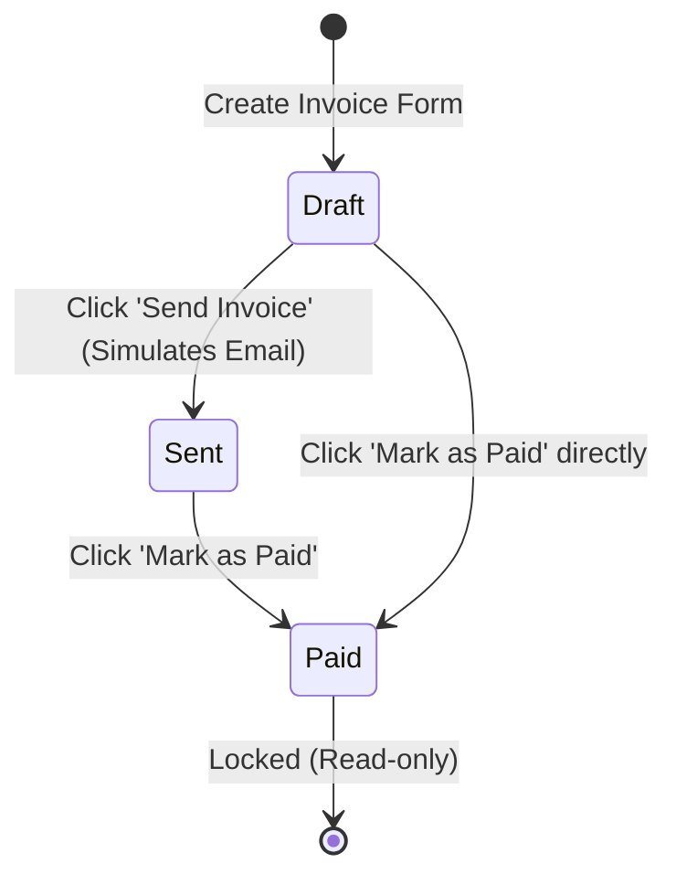

# Business Invoice Management System - Comprehensive Project Report

## 1. Project Overview
The **Business Invoice Management System** is a full-stack, SaaS-style web application designed to simplify the invoicing process for businesses. It allows organizations to manage their client lists, track revenue and payments accurately, and generate automated, downloadable PDF invoices securely.

This project was built to simulate a production-ready enterprise application while keeping the deployment and execution process extremely simple. It eliminates the need for complex third-party credentials (like SMTP for emails or Razorpay for payments) and external database hosting (like MongoDB Atlas), relying on elegant local simulations and flat-file databases instead.

---

## 2. Technology Stack & Tools Used

### Frontend (User Interface)
- **Next.js (React Framework):** Used for server-side rendering, routing (`pages/`), and building a robust, component-driven user interface.
- **TypeScript:** Adds static typing to JavaScript, improving code quality and developer experience by catching errors early.
- **Tailwind CSS:** A utility-first CSS framework used for rapid UI styling, responsive design, and applying consistent Light/Dark mode themes.
- **Shadcn UI & Radix UI:** Provides accessible, beautifully designed, and customizable UI components (like Buttons, Inputs, Cards, Badges, and Dialogs) without being tied to an inflexible library.
- **Axios:** A promise-based HTTP client used to seamlessly communicate with the backend API, automatically attaching authentication tokens (JWT) to requests.
- **Recharts:** A composable charting library built on React components, used to render the interactive monthly revenue bar charts on the dashboard.
- **jsPDF & jspdf-autotable:** Client-side libraries utilized to programmatically generate highly structured, printable PDF documents (invoices) directly within the browser.
- **Lucide React:** A beautiful and consistent icon library used throughout the application (e.g., in the sidebar, buttons, and notifications).

### Backend (Server & API)
- **Node.js:** The JavaScript runtime environment executing the backend server.
- **Express.js:** A fast, unopinionated, minimalist web framework for Node.js used to build the RESTful API routes and handle HTTP requests/responses.
- **NeDB (Node Embedded Database):** A pure JavaScript, lightweight database that uses the MongoDB API but stores data locally in flat JSON files. This replaced Mongoose/MongoDB to make the project 100% portable and easy to run without database installation.
- **JSON Web Tokens (JWT):** Used for stateless, secure user authentication. The backend generates a token upon login, which the frontend uses to authorize subsequent requests.
- **Bcrypt.js:** A cryptography library used to securely hash user passwords before storing them in the database, ensuring that plain-text passwords are never exposed.
- **Cors:** Express middleware to enable Cross-Origin Resource Sharing, allowing the Next.js frontend (port 3000) to communicate with the Express backend (port 5000).
- **Dotenv:** Loads environment variables from a `.env` file into `process.env`.

---

## 3. Database Architecture (NeDB)

To ensure the project is easy to run for evaluation without needing an active MongoDB server, the system uses **NeDB**. It creates local `.db` files (which are actually structured JSON files) inside the `backend/data/` directory.

### Collections (Data Models) Used:

1. **`users.db` (Authentication & Authorization)**
   - **Purpose:** Stores the internal staff members who can log into the system.
   - **Key Fields:** `name`, `email` (unique identifier), `password` (hashed via bcrypt), `role` (Admin or Accountant), `createdAt`.

2. **`customers.db` (Client Directory)**
   - **Purpose:** Stores the details of the businesses or individuals being billed.
   - **Key Fields:** `name`, `email`, `phone`, `company`, `address`, `gstNumber` (Tax ID), `createdAt`, `updatedAt`.

3. **`invoices.db` (Billing Records)**
   - **Purpose:** The core collection tracking every generated bill.
   - **Key Fields:** 
     - `invoiceNumber`: Unique identifier (e.g., INV-001).
     - `customerId`: Reference to the customer being billed.
     - `items`: An array of objects (product name, quantity, price, item total).
     - `subtotal`, `tax`, `totalAmount`: Calculated financial metrics.
     - `status`: Tracks the lifecycle state (`Draft`, `Sent`, `Paid`).
     - `createdBy`: Reference to the user who generated it.

4. **`payments.db` (Transaction History)**
   - **Purpose:** Logs all mock payments collected from clients.
   - **Key Fields:** `invoiceId` (reference to the paid invoice), `amount`, `paymentMethod` (e.g., Bank, Cash), `paymentDate`.

---

## 4. Architectural Diagrams

### Application Architecture Workflow

```mermaid
graph TD
    %% Frontend Layer
    subgraph Frontend [Next.js Client (Port 3000)]
        UI[React UI Components]
        Axios[Axios Interceptor]
        PDF[jsPDF Generator]
        Charts[Recharts UI]
    end

    %% Backend Layer
    subgraph Backend [Express Server (Port 5000)]
        Auth[Auth Middleware]
        Router[API Routes]
        Controllers[Business Logic Controllers]
    end

    %% Database Layer
    subgraph Database [Local NeDB Storage]
        UsersDB[(users.db)]
        CustDB[(customers.db)]
        InvDB[(invoices.db)]
        PayDB[(payments.db)]
    end

    %% Connections
    UI -->|HTTP Requests| Axios
    Axios -->|POST / PUT / GET / DELETE| Auth
    Auth -->|Validates JWT| Router
    Router --> Controllers
    Controllers -->|Read/Write JSON| Database
    
    %% Specific Actions
    UI -.->|Browser Action| PDF
    Controllers -->|Aggregation| Charts
```

### Invoice Lifecycle State Machine



---

## 5. Role-Based Access Control (RBAC) & Users

The system defines distinct roles to manage authorizations and ensure secure workflows.

### 1. Admin (Administrator)
- **Who they are:** Business owners, IT administrators, or top-level managers.
- **Capabilities:** Have absolute control over the system.
  - Can view all dashboard analytics (Revenue, Pending Payments).
  - Can create, edit, and delete Customers.
  - Can create, manage, delete Invoices, and orchestrate Payments.
  - Manage application Settings and Company Profiles (Future extensibility).

### 2. Accountant (Staff)
- **Who they are:** Financial staff members responsible for day-to-day bookkeeping.
- **Capabilities:** 
  - Capable of generating Invoices and downloading PDFs.
  - Can manage the Customer registry.
  - Can mark Invoices as 'Paid'.
  - **Restrictions:** Usually restricted from deleting critical documents or modifying the core system settings/company profiles. *(Note: The RBAC logic is structurally implemented in `authMiddleware.js`, and can be expanded depending on specific route protection needs).*

---

## 6. Core System Features in Detail

### Dashboard Analytics
- The server processes raw JSON arrays from `invoices.db` using JavaScript `reduce()` functions to calculate lifetime revenue, pending balances, and total system usage.
- This is visualized cleanly using **Recharts** to display a month-by-month financial bar graph to the Admin.

### Dynamic Interactive Invoicing Form
- Provides a modular form where users can dynamically push or pop items into an array field.
- **Real-time calculations:** As quantities and unit prices are typed, the React Hook state instantly calculates line-item totals, sub-totals, and grand totals (including dynamic tax percentages) before the form is even submitted to the backend.

### PDF Export & Document Generation
- Converts raw database JSON payloads into highly structured, professional PDF documents.
- Includes company headers, dynamic customer addresses, and beautifully styled tables containing the line items and exact financial breakdowns.
- Achieved entirely client-side using `jsPDF` without putting load on the backend server.

### Simulated External Integrations
- **Emailing Invoices:** Instead of requiring real SMTP credentials, clicking "Send Invoice" triggers a 1-second UI loading simulation and updates the invoice state to "Sent" via the backend API, notifying the user.
- **Payment Gateway:** Rather than calling a real Stripe/Razorpay SDK, the internal `/api/payments` endpoint generates a secure mock transaction receipt in `payments.db` and maps the Invoice status natively to "Paid", reflecting instantly on the Dashboard analytics.

---

## 7. Setup and Execution Instructions

Because the project relies on local `.db` files, running it is incredibly straightforward.

**Step 1: Start the Backend (API & DB)**
```bash
cd backend
npm install
npm run start
# Runs on http://localhost:5000
```

**Step 2: Start the Frontend (UI)**
```bash
cd frontend
npm install
npm run dev
# Runs on http://localhost:3000
```

**Step 3: Access the Platform**
- Open a browser and navigate to `http://localhost:3000`.
- Register a new Admin or Accountant account to begin securely testing the features!

---

*End of Report*
